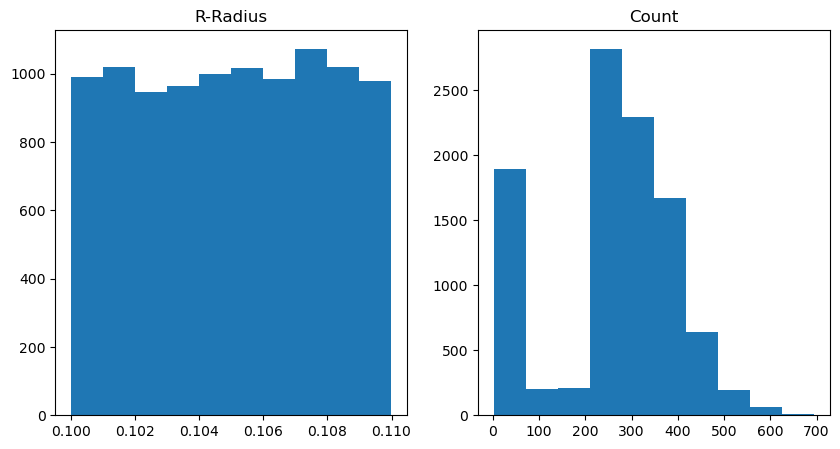
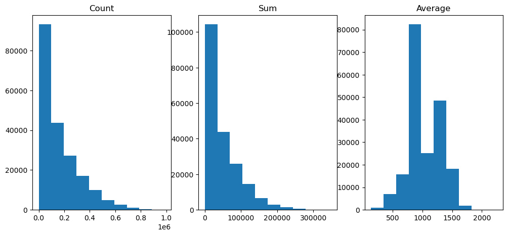
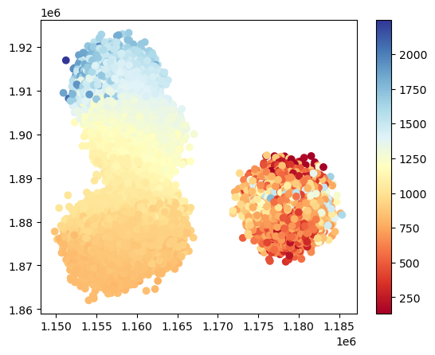
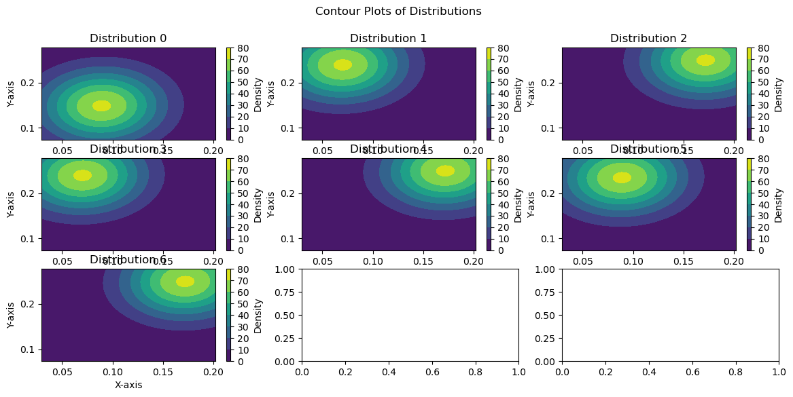
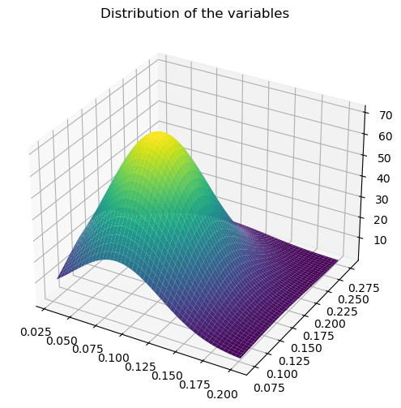

# Generative Crime

Machine learning techniques are frequently classied into three buckets:  supervised learning, unsupervised learning, and reinforcement learning.  In the supervised case, we generally know the hypotheses we want our algorithms to predict.  This can be things like predicting income based on socio-economic features in regression or predicting categorical features like object type in image recognition.  However, we do not always know what we want our models to predict.  In that case, we can appeal to unsupervised learning where algorithms learn the hypotheses themselves.  We might want to go even further and desire not only for our models to be able to use those hypotheses to register predictions but to be able to recreate the data from those hypotheses.  In this latter case, we aim for what is called *generative models*.  Here I explore both unsupervised and generative modeling techniques.  **This project demonstrates my ability to use powerful unsupervised learning techniques for building generative models useful for predicting and modeling data.**

Unsupervised learning and generative modeling can be useful in a number of applications.  One such application is the application of limited resource application.  Manpower intensive activities like policing or social services are often resource constrained.  Consequently, governments would like to know where should available resources be best deployed.  This requires having a model (in the general sense) about possible hypotheses correlated with social symptoms like crime.  Unsupervised learning can help here by *learning latent hypotheses predictive of those social symptoms and the probability of those hypotheses*.  From Chicago crime report counts, sums, and averages, I construct a series of models that learn geographically locatable hypotheses useful for predicting and recreating those Chicago crime reports.  This can be very informative for where to allocate various government services.

I analyzed three datasets containing geographical information and statistics about Chicago crime reports.  This data required grooming and cleaning using **pandas**.  From this data, I constructed a sequence of generative models via the unsupervised learning technique of **expectation maximization** to learn **Gaussian mixture models**.  The code for these algorithms was custom, though I am familiar with **scikitlearn**'s functions to do the same task.  I then evaluated those models on separate test data using a powerful Bayesian measure of predictive performance with an Occam's prior, the **Bayesian Information Criterion (BIC)**.

## Datasets

The primary data sets were taken from the UCI Machine Learning Repo found [here](https://archive-beta.ics.uci.edu/dataset/493/query+analytics+workloads+dataset).  There were 3 data sets.  Each one consisted of an x and y coordinate that gives the center of a circle that characterizes a geographic area.  In addition, the radius of that circle was included in each data set.  According to the documentation and the **pandas-profile** report, both the center of the cirlces and the radii were sampled from a Gaussian distribution.  The other items in the datasets dependend on the specific set.  Data set 2 had the number of police crime reports from the sampled geographic area, while data 3 had the number of crime reports plus the sum and averages of those reports.

The initial data sets had a few issues.  First, included in the data sets were the columns and rows labels.  These had to be dropped from the groomed data set.  In addition, data set 3 had a number of NaN values for the sums and average of crime reports.  After identifying the culprit entries, those entries were dropped from the cleaned data set.

Once cleaned, the data sets were then visualized in a Python notebook.  I created histograms for the crime counts in both datasets 2 and 3 as well as the sums and averages for dataset 3.  The results indicated an exponential distribution for the counts across both datasets.

 

I also performed a series of scatter plots to clue myself into the clustering behavior of the different data sets.  Dataset2 showed clear clustering behavior, with a high crime area appearing to occur at the intersection of two clusters.  Dataset3 showed no clear clustering behavior on crime report counts, but it did show clustering behavior on the crime averages.

 

Both of these results suggested a type of clustering method would be appropriate.  I choose to do a type of generative clustering to better learn the data.

## Statistical Methods

All models were trained using **maximum likelihood estimation (MLE)**.  This method works by finding the model in the training process that maximizes the likelihood of the data given the model or

$$ MLE(\mathcal{D}) = \underset{\theta}{\arg \max} P(\mathcal{D} | \theta) $$

where $\mathcal{D}$ is the data and $\theta$ is the model.  In my case, I wanted this to be a minimization problem so I aimed for the models to minimize the negative loglikelihood or

$$ MLE_{nll}(\mathcal{D}) = \underset{\theta}{\arg \min} - \log P(\mathcal{D} | \theta) $$

I had to evaluate the fitness of the different Gaussian Mixture Models against the data.  To that end, I broke up the 2 data sets I used, data set 2 and data set 3, into training and validation sets.  The split was 80/20 training to validation.  I then tested the fit of the models against the validation set using the **Bayesian Information Criterion (BIC)**.  The BIC combines the loglikelihood of a model with a prior for a simpler model:

$$ BIC(\theta) = - \log P(\mathcal{D} | \theta) + \frac{k}{2} \log N $$

where $k$ is the number of model parameters (here the 2 times the number of Gaussians) and $N$ is the number of samples in the data.  The BIC is ideal for evaluating models that can fit an arbitrary dataset like Gaussian Mixture Models (GMM) because it takes into account both the fitness of the model as well as the model's complexity.  Intuitively, we want simpler models because we know that GMMs can fit a distribution to arbitrary precision with enough parameters.

## Machine Learning Methods

Since the data naturally clusters geographically, an unsupervised learning approach involving some form of clustering would be best.  However, I wanted more than just clusters; I wanted to be able regenerate the underlying data distribution to sample new points.  This is desirable because it gives the data scientist the ability to not only make prediction but to duplicate the data as need be.

For that end, I elected to forgo clustering and use a **Gaussian Mixture Model (GMM)** trained via **Expectation Maximization** (EM) algorithm.  The intuition behind any mixture model is that a probability distribution can be approximated by taking an expectation over many different distributions.  We essentially weight the distributions by their prior probability and the take the sum of those priors by the products of their likelihoods.  This decomposes the target probability distribution into multiple, simpler distribution which we might be able to parameterize.  In the case of a Gaussian mixture, our learned distribution is:

$$ P(\mathbf{x}) = P(\mathbf{x} | \mathcal{N}(\mu_{0}, \sigma_{0})) \pi_{0} + P(\mathbf{x} | \mathcal{N}(\mu_{1}, \sigma_{1})) \pi_{1} + \dots + P(\mathbf{x} | \mathcal{N}(\mu_{k}, \sigma_{k})) \pi_{k} $$

where each $\pi$ is the prior probability of the corresponding mixture distribution.  This is just an application of the law of total probability.

The EM algorithm works in a manner familiar to students of clustering.  It starts with a random initialization of model parameters and priors (typically a uniform prior).  Then the algorithm proceeds in two steps:

1. Expectation:  for each data point, assign the mixture distributions each a responsibility that corresponds to how likely that point is for that distribution.
2. Maximization:  update the distribution parameters based on their responsibilities.

The expectation step corresponds in k-means clustering to assigning data points to cluster and the maximization step corresponds to recentering the clusters based on their members.  The difference here is that every point provides a certain degree (probability) of each distribution to be responsible for its generation.

While the EM algorithm is guaranteed to converge under MLE, convergence might take a while.  Towards that end, I employed two methods of early stopping.  The first set a hard limit of 50 epochs for each trained distribution.  The second used an epsilon change in improvement method.  This essentially measures the difference in the change of the negative log likelihood.  If that change is below a certain epsilon, then the algorithm terminates.

All code here is custom using the **numpy** library.  Readers should note that **scikit-learn** has a GMM implementation that is likely more performant than my implementation here.

## Experiments

Experiments consisted of training GMMs with up to 10 mixture Gaussians and then evaluating those GMMs using the BIC on the validation set.  Separate runs were executed for data sets 2 and 3 (data set 1 was not used because it only included geographic locations).

Training was done using Python's **multiprocessing** module.  Importantly, **pool** was used to delegate tasks for separate training runs to different CPU cores, dramatically speeding up training time.  The larger the number of cores, the faster the training process would take.

## Results

Results showed that for data set 2, models with 7 clusters and 10 clusters performed best.  I performed 2D contour plots to illustrate where the clusters lie for data set 2:

These contour plots show that the geographic clusters roughly track the intuitive clusters we saw in the initial data analysis.  What is interesting is that there are multiple clusters for the data in the high crime area, indicating particular neighborhoods that might be salient.

A 3D contour plot was also created to illustrate the overall distributional shape of the clusters (how sharply peaked they happen to be):

## Discussion
