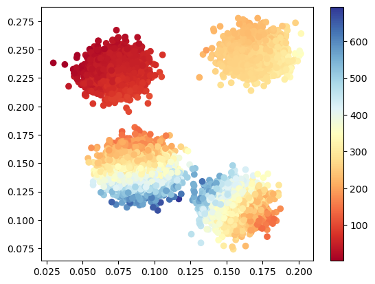

# Generative Crime

Machine learning techniques are frequently classied into three buckets:  supervised learning, unsupervised learning, and reinforcement learning.  In the supervised case, we generally know the hypotheses we want our algorithms to predict.  This can be things like predicting income based on socio-economic features in regression or predicting categorical features like object type in image recognition.  However, we do not always know what we want our models to predict.  In that case, we can appeal to unsupervised learning where algorithms learn the hypotheses themselves.  We might want to go even further and desire not only for our models to be able to use those hypotheses to register predictions but to be able to recreate the data from those hypotheses.  In this latter case, we aim for what is called *generative models*.

This can be useful in a number of applications.  Here I demonstrate one such application.  Manpower intensive activities like policing or social services are often resource constrained.  Consequently, governments would like to know where should available resources be best deployed.  This requires having a model (in the general sense) about possible hypotheses correlated with social symptoms like crime.  Unsupervised learning can help here by *learning latent hypotheses predictive of those social symptoms and the probability of those hypotheses*.  From Chicago crime report counts, sums, and averages, I construct a series of models that learn geographically locatable hypotheses useful for predicting and recreating those Chicago crime reports.  This can be very informative for where to allocate various government services.

## Datasets

## Statistical Methods

## Machine Learning Methods

## Experiments

## Results

## Discussion
